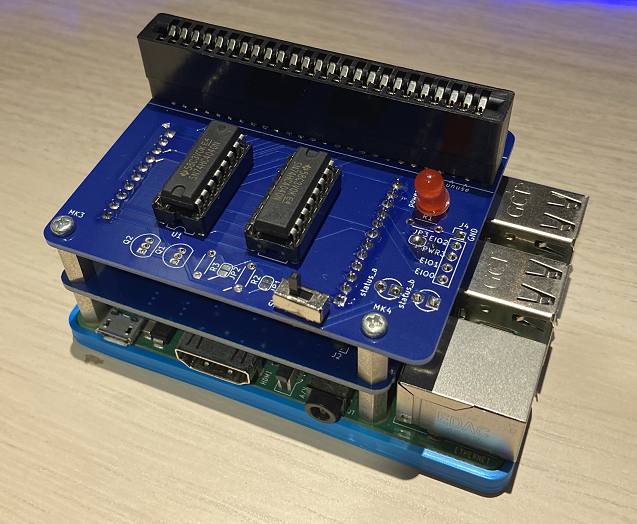

# sfc-dumper-py
- Dumper for sfc by Python
- This dumper is a HAT for Raspberry Pi and we also publish the source code to make it work in this repository.

## Environment
- Raspberry pi 3 b+, or later (Recommend)
- Raspberry pi zero, or later

## How to use
After setting Raspberry pi (raspbian install),
at Raspberry pi, or remote connecting (ex ssh,...)
```
pip install RPi.GPIO
python3 sfc-dumper.py filename
```

## Hardware
This is PCB of Dumper Py.

- PCB-bottom 


- PCB-top 


### Parts list
#### 必須
値段は参考。
ICソケットはそれぞれ2個使います。バラで購入できるならそれで問題ないです。

|名称	                                |数量	|入手先	        |参考|
|:---|:---:|---|---|
|ラズパイ 3 b+                            |1       |メルカリなど    |半導体不足のため一般調達が非常に高いです。|
|抵抗内蔵５ｍｍＬＥＤ                      |1      |秋月電子        |https://akizukidenshi.com/catalog/g/gI-12517/|
|小型スライドスイッチ　１回路２接点         |1      |秋月電子        |https://akizukidenshi.com/catalog/g/gP-12723/|
|CR22A-50D-2.54DS(70)                    |1      |任意             |PCBと同時配布予定（入手先が少ない、もしくはロット入手）|
|74HC244	                                |2	|マルツオンライン	|https://www.marutsu.co.jp/GoodsDetail.jsp?salesGoodsCode=37576&shopNo=3|
|74HC4040                                |2	|マルツオンライン	|https://www.marutsu.co.jp/pc/i/18963/|
|Raspberry Pi専用スペーサー（MPS-M2611）   |1       |サンハヤト         |https://shop.sunhayato.co.jp/products/mps-m2611|
|六角オネジ・メネジ　ＭＢ２６－１１         |4       |秋月電子            |https://akizukidenshi.com/catalog/g/gP-11546/|

※ICソケットは有りでも無しでも好きな方で。

#### オプション
- 抵抗内蔵５ｍｍＬＥＤ x2
- トランジスタ　２ＳＣ１８１５ x2
- ※抵抗内蔵LEDを使わない場合は、抵抗x3（抵抗値はLEDのスペックによる）
- Bottom ケース：3Dプリンタで作りました　(データ：https://www.thingiverse.com/thing:2962525)


## 完成図
最低限の実装になります。
- オプションパーツの実装無しです。
- ラズパイと接続するとこのような見た目になります。
- ２段のスタック構造になっています。
- ※Raspberry Pi専用スペーサーのナットは使いませんでした。


## 分割した様子
- 表


- 裏


## おまけ
ご覧の通り、LEDが曲がっております。
カセットのせり出しに対して、LEDが攻め位置だったようです。
今後要検討です。
- LED版ピサの斜塔


## Reference
- 